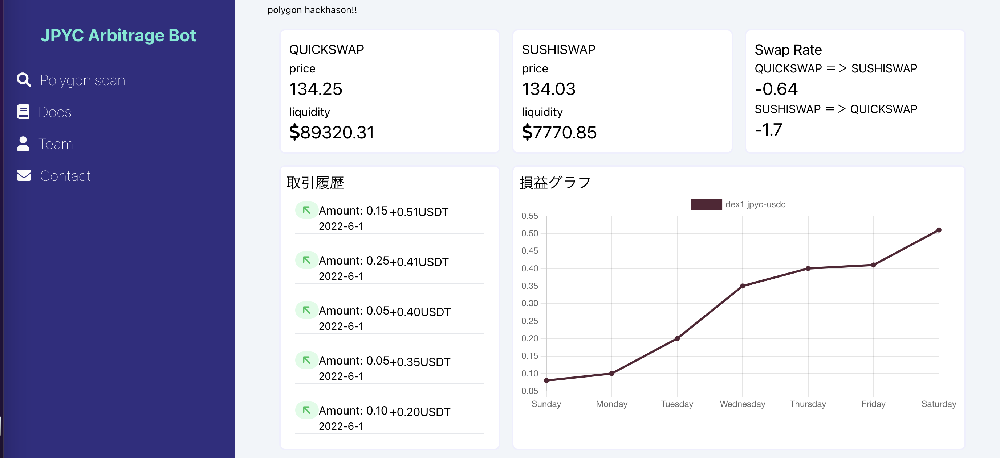
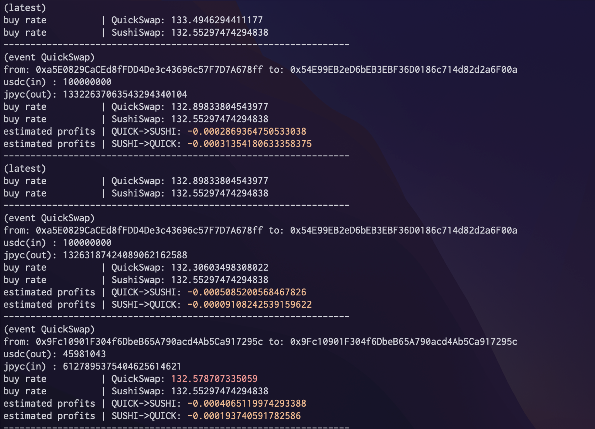

# プロジェクト名
JPYC Arbitrage

# プロジェクトについて
Polygonネットワーク上のDEXで裁定機会を算出しアービトラージを行う。取引結果はcsvに保存されており、フロントエンドから直近の取引履歴・収益推移・各DEXでのスワップレート等が確認できるようになっている。バックエンドでは各プールのトークン量を保持しており、ローカルでレートが計算可能になっている。

フロントエンド画像

バックエンド画像

# 解決しようとしている課題
JPYCのDEX間およびブロックチェーン間での価格の平衡化
JPYCと法定通貨JPYとの価格の平衡化
(自身の収益の最大化)

# 使用した技術
使用言語: node.js React solidity

# polygonscan
https://polygonscan.com/address/0x4dC624B08f2Af43f04Ed2D78c05c2bCDACaDd70a

# 直面した課題
アービトラージを行う上で他のノードよりも早くトランザクションを通す必要がある
- 通信回数を減らす(<b>解決済</b>)
- 独自のノードを立てる
などの工夫が必要である

他ブロックチェーン間でのアービトラージのリスクヘッジ
- スリッページのリスクをヘッジする必要がある

法定通貨との価格を比べる
- オラクル問題

# 実行環境
npm 8.5.0
node v16.14.1

